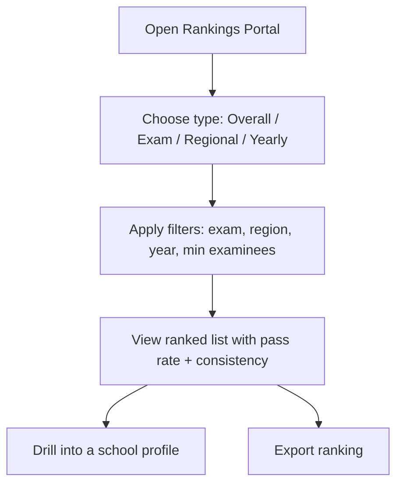
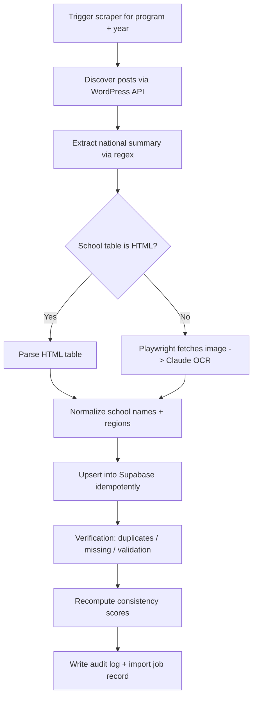
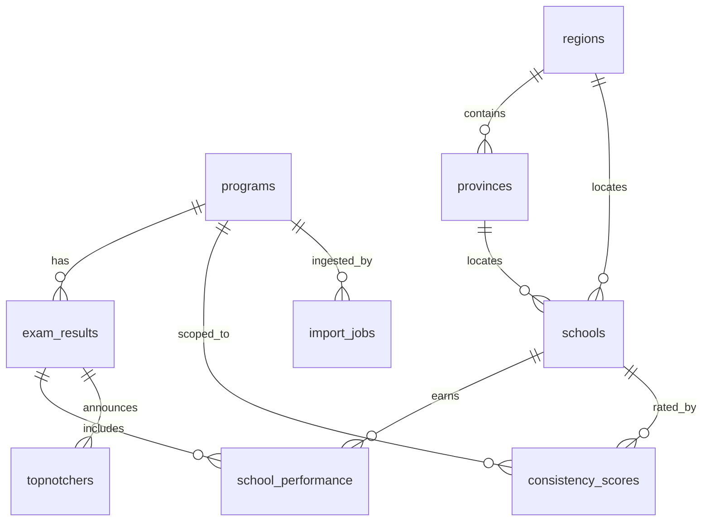
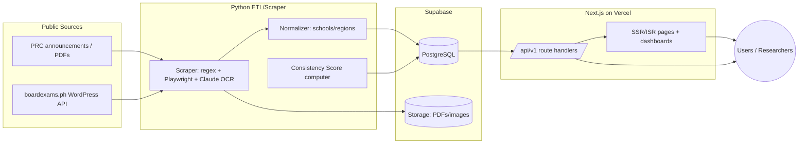

# Pasa Rate PH — Software Requirements Specification (SRS)

Version 1.0 (MVP) · Status: Draft for Approval
Prepared as a Capstone / Startup Proposal / Software Requirements Specification

---

## Table of Contents
1. [Executive Summary](#1-executive-summary)
2. [Introduction](#2-introduction)
3. [Background of the Problem](#3-background-of-the-problem)
4. [Problem Statement](#4-problem-statement)
5. [Project Objectives](#5-project-objectives)
6. [Scope and Limitations](#6-scope-and-limitations)
7. [Target Users](#7-target-users)
8. [User Personas](#8-user-personas)
9. [Functional Requirements](#9-functional-requirements)
10. [Non-Functional Requirements](#10-non-functional-requirements)
11. [System Features](#11-system-features)
12. [User Workflows](#12-user-workflows)
13. [Database Requirements](#13-database-requirements)
14. [API Requirements](#14-api-requirements)
15. [Analytics and Reporting Features](#15-analytics-and-reporting-features)
16. [Security Requirements](#16-security-requirements)
17. [System Architecture Overview](#17-system-architecture-overview)
18. [User Interface Modules](#18-user-interface-modules)
19. [Expected Benefits](#19-expected-benefits)
20. [Conclusion](#20-conclusion)

---

## 1. Executive Summary

**Pasa Rate PH** is a centralized, web-based platform that transforms Professional Regulation Commission (PRC) licensure examination results into a searchable, analyzable, and queryable database. Today, the PRC publishes school-by-school board examination performance through scattered PDFs, announcements, and press releases. This format makes historical analysis slow, manual, and error-prone for the people who need it most: students choosing schools, parents evaluating investments in education, researchers studying outcomes, journalists reporting on education quality, and institutions benchmarking their own performance.

Pasa Rate PH extracts, organizes, normalizes, and presents this public data through an interactive website and a public REST API. The platform provides global search, school profile pages, board-examination pages, a school comparison tool, a rankings portal, advanced filtering, data export, and a public API. On top of the raw data, the platform layers ten analytics features, including a proprietary **Consistency Score** that rewards stable, reliable performance and penalizes volatility.

For Version 1 (MVP), the platform supports **16 licensure programs**: LET Elementary, LET Secondary, CPALE (Accountancy), Nursing, Criminology, Civil Engineering, Electronics Engineering, Electrical Engineering, Mechanical Engineering, Medicine, Medical Technology, Architecture, Pharmacy, Psychology, Dentistry, and Agriculture. The architecture is deliberately **extensible**: programs are stored as data in a registry table, so adding new board exams in future versions requires no schema or architectural changes.

The system is built on **Next.js (React + TypeScript)** for the website and public API, **Supabase (PostgreSQL)** for data and storage, and a **Python ETL/scraper** that ingests data from public sources using HTML parsing with an OCR fallback. The platform targets sub-2-second search and sub-1-second API responses, with daily backups and documented recovery procedures.

---

## 2. Introduction

### 2.1 Purpose
This document specifies the requirements for the Pasa Rate PH platform. It defines the problem, scope, target users, functional and non-functional requirements, system features, data model, API, analytics, security, and architecture. It serves as the single reference for engineering, design, QA, and stakeholders.

### 2.2 Intended Audience
- Project sponsors and evaluators (capstone panel / investors)
- Software engineers and architects implementing the platform
- UI/UX designers
- QA engineers and data analysts
- Future maintainers extending the program coverage

### 2.3 Product Scope
Pasa Rate PH is an **analytics and discovery** product built on **public** PRC data. It does not store or expose private candidate information beyond what PRC already publishes (e.g., the publicly announced Top 10 "topnotchers" per exam). It is read-heavy: the public consumes data; a small admin team curates and verifies it.

### 2.4 Definitions, Acronyms, and Abbreviations

| Term | Meaning |
|------|---------|
| PRC | Professional Regulation Commission (Philippines) |
| Pass rate | passers / examinees × 100 for a given school and exam cycle |
| Exam cycle | A single administration of a board exam (e.g., CPALE May 2025) |
| Topnotcher | A nationally ranked Top 10 passer for an exam cycle |
| Consistency Score | Proprietary metric rating long-term school reliability |
| National pass rate | passers / examinees across all examinees nationwide for a cycle |
| Region / Province | Philippine administrative geography used for filtering |
| MVP | Minimum Viable Product (Version 1) |
| ETL | Extract, Transform, Load (the data ingestion pipeline) |
| RLS | Row Level Security (Supabase/Postgres access control) |
| SSR / ISR | Server-Side Rendering / Incremental Static Regeneration |

### 2.5 References
- PRC official announcements and press releases (public)
- boardexams.ph (aggregated public results, used as a discovery source)
- WordPress REST API (used for content discovery on aggregator sites)

---

## 3. Background of the Problem

The PRC administers licensure examinations across dozens of professions. After each exam cycle, it publishes:
1. **National summary statistics** (e.g., "X out of Y passed the Nurse Licensure Examination").
2. **Performance of schools/universities** — per-school passers, examinees, and rates, often as **images or PDFs**.
3. **Top 10 successful examinees** (topnotchers) per exam.
4. The **full roll of passers** (thousands of names), typically as image-based PDFs.

This information is genuinely public and important, but its **format** creates friction:
- Results are spread across many separate posts, PDFs, and press releases.
- School performance tables are frequently **images**, not machine-readable text, so they cannot be searched, sorted, or analyzed without manual transcription.
- There is **no historical view**: comparing a school's Nursing pass rate across ten years requires hunting down ten separate announcements.
- There is **no cross-school comparison**, **no rankings portal**, and **no regional analytics**.

As a result, the people who most need this data — prospective students and their families — make high-stakes decisions (which school to attend, often a multi-year, multi-hundred-thousand-peso commitment) with incomplete information.

---

## 4. Problem Statement

> PRC board examination results are public but **fragmented, non-machine-readable, and historically inaccessible**. There is no centralized, searchable, and analyzable source that lets students, parents, researchers, journalists, and institutions evaluate school performance across exams, regions, and years.

Pasa Rate PH solves this by **consolidating** PRC results into a normalized database and **surfacing** them through search, profiles, rankings, comparison tools, analytics, exports, and a public API.

---

## 5. Project Objectives

**Primary objectives**
1. Consolidate PRC licensure results for the 16 MVP programs into a single normalized database.
2. Provide global search across schools, exams, years, months, and regions with results under 2 seconds.
3. Deliver dedicated School Profile and Board Examination pages with historical performance.
4. Provide rankings (overall, by exam, by region, by year) with rich filtering.
5. Offer a side-by-side school comparison tool.
6. Compute and display ten analytics features, including the proprietary Consistency Score.
7. Expose a documented, rate-limited public REST API.
8. Enable CSV/Excel export of rankings, school results, exam results, and filtered reports.

**Secondary objectives**
9. Provide an admin module for data import, verification, and audit logging.
10. Ensure the architecture is extensible so new programs are added as data, not code/schema changes.
11. Meet performance, security, and reliability targets (Section 10).

**Success metrics**
- ≥ 10 years of historical coverage per program where public data exists.
- Search median latency < 2 s; API median latency < 1 s.
- 100% of the 16 MVP programs represented with national + per-school data where available.
- Zero storage of non-public personal data.

---

## 6. Scope and Limitations

### 6.1 In Scope (Version 1 / MVP)
- The following **16 programs only**:

| # | Program | Exam Code | Notes |
|---|---------|-----------|-------|
| 1 | LET Elementary | `LET-E` | Teachers (Elementary level) |
| 2 | LET Secondary | `LET-S` | Teachers (Secondary level) |
| 3 | Accountancy (CPA) | `CPALE` | Certified Public Accountant LE |
| 4 | Nursing | `NLE` | Nurse Licensure Examination |
| 5 | Criminology | `CLE` | Criminologists LE |
| 6 | Civil Engineering | `CELE` | Civil Engineers LE |
| 7 | Electronics Engineering | `ECE` | Electronics Engineers LE |
| 8 | Electrical Engineering | `REE` | Registered Electrical Engineers LE |
| 9 | Mechanical Engineering | `MELE` | Mechanical Engineers LE |
| 10 | Medicine | `PLE` | Physician LE |
| 11 | Medical Technology | `MTLE` | Medical Technologists LE |
| 12 | Architecture | `ALE` | Architects LE |
| 13 | Pharmacy | `PhLE` | Pharmacist LE |
| 14 | Psychology | `PSY` | Psychologist / Psychometrician LE |
| 15 | Dentistry | `DLE` | Dentist LE |
| 16 | Agriculture | `AgriLE` | Agriculturist LE |

- Global search, school profiles, exam pages, comparison, rankings, filtering, export, public API.
- Ten analytics features + Consistency Score.
- Admin import, verification, and audit logs.

### 6.2 Out of Scope (Version 1)
- Board exams **not** listed above (added in future versions as registry rows).
- The **full roll of individual passers** (thousands of names). The platform stores only the **publicly announced Top 10 topnotchers** per cycle, which is sufficient for all features and avoids unnecessary personal-data handling.
- User accounts for the public (browsing is anonymous); only admins authenticate.
- Predictive ML scoring beyond the deterministic Consistency Score and trend classification (a hook is provided for future predictive models).

### 6.3 Limitations and Assumptions
- Data completeness depends on what PRC/aggregators have published; some cycles or schools may be missing.
- School performance tables published as images rely on OCR, which may require human verification.
- Region/province attribution for schools is enriched from reference data and may need manual correction for ambiguous names.
- The platform reflects public data and is **not** an official PRC product.

---

## 7. Target Users

| User | Primary Goal |
|------|--------------|
| Senior High School Students | Choose a college/program with strong board-exam outcomes |
| College Students | Validate their school's standing; plan for the board exam |
| Parents and Guardians | Make informed decisions about where to invest in education |
| Academic Researchers | Study performance trends across time, region, and institution type |
| Journalists and Media Organizations | Source verifiable statistics for education reporting |
| Educational Institutions | Benchmark performance; market verified results |
| School Administrators | Track ranking movement and consistency over time |

---

## 8. User Personas

### Persona 1 — "Aira," Senior High School Student (17)
- **Context:** Deciding between three universities for Nursing.
- **Needs:** Compare NLE pass rates and consistency across schools; see trends, not just one year.
- **Pain:** PRC PDFs are images; she can't easily compare schools.
- **Pasa Rate PH value:** Comparison tool + Consistency Score + 10-year trend chart.

### Persona 2 — "Mr. and Mrs. Reyes," Parents (45/43)
- **Context:** Funding a Civil Engineering degree; want confidence in the school.
- **Needs:** Plain-language summary: latest pass rate, national rank, consistency rating.
- **Pasa Rate PH value:** School Profile "Performance Summary" cards.

### Persona 3 — "Dr. Santos," Academic Researcher (38)
- **Context:** Studying regional disparities in board outcomes.
- **Needs:** Bulk, structured data across regions and years; export to Excel; API access.
- **Pasa Rate PH value:** Regional analytics + filtering + CSV/Excel export + public API.

### Persona 4 — "Janelle," Journalist (29)
- **Context:** Writing a feature on the hardest board exams.
- **Needs:** National passing-rate trends; difficulty analysis; citable figures with source links.
- **Pasa Rate PH value:** Board Examination pages + difficulty trends + source URLs.

### Persona 5 — "Engr. Cruz," School Administrator (50)
- **Context:** Reports outcomes to the school board.
- **Needs:** Ranking history, consistency, school-vs-national comparison; exportable reports.
- **Pasa Rate PH value:** Ranking history analytics + export module.

---

## 9. Functional Requirements

Each requirement is labeled `FR-x` and (where helpful) accompanied by a user story.

### 9.1 Search
- **FR-1 Global Search.** Users can search by school name, board examination, year, examination month, and region. Free-text queries like "University of Santo Tomas Nursing 2025", "Civil Engineering 2024", and "NCR Nursing Schools" are parsed into structured filters.
  - *User story:* "As a student, I want to type a school + program + year so that I can immediately find relevant results."
- **FR-2 Search Results.** Results display school information, pass rates, rankings, and historical records, grouped by entity type (schools / exams / regions / topnotchers).
- **FR-3 Search Performance.** Search returns results in under 2 seconds (see NFR).

### 9.2 School Profiles
- **FR-4 School Profile Page.** Each school has a dedicated page with: school information (region, province, school type), programs with board examinations, a performance summary (latest pass rate, total passers, total examinees, national ranking, consistency score), and a historical results table (year, examination, passers, examinees, pass rate, ranking).
  - *User story:* "As a parent, I want a single page summarizing a school's outcomes so that I can decide quickly."

### 9.3 Board Examination Pages
- **FR-5 Exam Page.** Each licensure exam has a page showing national passing rate, total examinees, total passers, top performing schools, and historical examination statistics.

### 9.4 Comparison
- **FR-6 Comparison Tool.** Users compare multiple schools side-by-side on pass rate, passers, examinees, ranking, consistency score, and historical performance.
  - *User story:* "As a student, I want to compare 3 schools so that I can choose the best fit."

### 9.5 Rankings
- **FR-7 Rankings Portal.** Provides overall school rankings, board-examination rankings, regional rankings, and yearly rankings.
- **FR-8 Ranking Filters.** Filter by examination type, region, year, and minimum number of examinees.

### 9.6 Filtering
- **FR-9 Advanced Filtering.** Filter results by region, province, board examination, year, pass-rate range, ranking range, and minimum examinee count.

### 9.7 Export
- **FR-10 Data Export.** Export rankings, school results, examination results, and filtered reports to CSV and Excel.

### 9.8 Public API
- **FR-11 Public REST API.** Endpoints for schools, examinations, rankings, historical results, and search queries, with pagination, filtering, sorting, and rate limiting.

### 9.9 Analytics
- **FR-12..FR-21** The ten analytics features in Section 15 (trend analysis, decade analysis, school-vs-national, ranking history, regional analytics, exam popularity, consistency scoring, difficulty trends, leaderboard, distribution).

### 9.10 Administration
- **FR-22 Data Import.** Import PRC PDFs and examination reports; extract school performance data.
- **FR-23 Data Verification.** Duplicate detection, missing-data detection, and validation checks.
- **FR-24 Audit Logs.** Record imports, updates, and deletions.

### 9.11 Extensibility
- **FR-25 Program Registry.** Supported programs are stored as data. Adding a program is a data operation (one registry row + scraper keyword mapping), requiring no schema or architectural change.

---

## 10. Non-Functional Requirements

| ID | Category | Requirement |
|----|----------|-------------|
| NFR-1 | Performance | Search results return in < 2 seconds (median). |
| NFR-2 | Performance | API responses return in < 1 second (median) for standard queries. |
| NFR-3 | Scalability | Supports all 16 MVP programs and is designed to scale to all PRC exams and decades of records without re-architecture. |
| NFR-4 | Security | Input validation on all inputs; parameterized queries; rate limiting; secure API access. |
| NFR-5 | Reliability | Daily automated backups; documented recovery procedures; ingestion is idempotent (re-running the scraper does not duplicate rows). |
| NFR-6 | Usability | Responsive, mobile-first UI; accessible (WCAG AA target); plain-language summaries. |
| NFR-7 | SEO | School/exam pages server-rendered for indexability. |
| NFR-8 | Maintainability | Typed codebase; program registry as single source of truth; documented ETL. |
| NFR-9 | Observability | Structured logs for ingestion and API; error tracking. |
| NFR-10 | Privacy/Compliance | Stores only public data; no full passer rolls; clear "unofficial" disclaimer and source attribution. |

---

## 11. System Features

This section summarizes each user-facing feature. Detailed analytics are in Section 15.

### A. Global Search System
Search by school name, board examination, year, examination month, and region. Natural-language queries are tokenized and matched against schools, programs, regions, and years. Results show school information, pass rates, rankings, and historical records.

### B. School Profile Pages
School information (region, province, school type) and programs offered; a performance summary (latest pass rate, total passers, total examinees, national ranking, consistency score); and a historical results table (year, examination, passers, examinees, pass rate, ranking).

### C. Board Examination Pages
For each licensure exam: national passing rate, total examinees, total passers, top performing schools, and historical examination statistics.

### D. School Comparison Tool
Compare multiple schools side-by-side on pass rate, passers, examinees, ranking, consistency score, and historical performance.

### E. Rankings Portal
Overall, board-examination, regional, and yearly rankings, filterable by examination type, region, year, and minimum examinees.

### F. Advanced Filtering System
Filter by region, province, board examination, year, pass-rate range, ranking range, and minimum examinee count.

### G. Data Export Module
Export rankings, school results, examination results, and filtered reports as CSV and Excel.

### H. Public API
REST endpoints for schools, examinations, rankings, historical results, and search; with pagination, filtering, sorting, and rate limiting.

### Administrative Features
1. **Data Import Module** — import PRC PDFs/reports, extract school performance.
2. **Data Verification Module** — duplicate detection, missing-data detection, validation checks.
3. **Audit Logs** — record imports, updates, and deletions.

---

## 12. User Workflows

### 12.1 End-User: Find and Compare Schools
```mermaid
flowchart TD
  A[Land on homepage] --> B[Type query: "UST Nursing 2025"]
  B --> C[Search parses school + program + year]
  C --> D[Results grouped: schools / exams / regions]
  D --> E[Open School Profile]
  E --> F[View summary + history + trend chart]
  F --> G[Add to Comparison]
  G --> H[Compare up to N schools side-by-side]
  H --> I[Export comparison to CSV/Excel]
```

### 12.2 End-User: Explore Rankings


### 12.3 Admin: Ingest a New Exam Cycle


---

## 13. Database Requirements

PostgreSQL (Supabase). Design goals: normalized, idempotent ingestion, extensible program registry, fast filtering via reference tables and indexes.

### 13.1 Entities

- **programs** — registry of supported board exams (the extensibility backbone).
  `id, exam_code, name, level, slug, is_active, created_at`
- **regions** — Philippine administrative regions. `id, name, code`
- **provinces** — provinces linked to a region. `id, region_id, name`
- **schools** — deduplicated institutions. `id, name, slug, region_id, province_id, school_type, created_at`
- **exam_results** — one row per program per cycle. `id, program_id, month, year, total_takers, total_passers, pass_rate, source_url, scraped_at` · UNIQUE(`program_id, month, year`)
- **school_performance** — junction of school × exam cycle (core data). `id, exam_result_id, school_id, takers, passers, pass_rate, rank, scraped_at` · UNIQUE(`exam_result_id, school_id`)
- **topnotchers** — Top 10 per cycle. `id, exam_result_id, rank, name, school, rating, scraped_at` · UNIQUE(`exam_result_id, rank`)
- **consistency_scores** — precomputed per school × program. `id, school_id, program_id, avg_rate, volatility, score, label, years, computed_at` · UNIQUE(`school_id, program_id`)
- **import_jobs** — ingestion runs. `id, program_id, year, status, rows_affected, started_at, finished_at, notes`
- **audit_logs** — change history. `id, actor, action, entity, entity_id, detail, created_at`

### 13.2 Relationships


### 13.3 Indexing Strategy
- `exam_results (program_id, year)`, `exam_results (year)`
- `school_performance (exam_result_id)`, `school_performance (school_id)`, `school_performance (rank)`
- `schools (region_id)`, `schools` trigram index on `name` for fast `ILIKE` search
- `topnotchers (exam_result_id)`

### 13.4 Integrity & Idempotency
- All ingest writes use `ON CONFLICT ... DO UPDATE` against the UNIQUE keys above, so re-running the scraper is safe (NFR-5).
- Foreign keys enforce referential integrity; `ON DELETE` rules cascade performance/topnotcher rows with their exam cycle.

---

## 14. API Requirements

Base path: `/api/v1`. JSON responses. Public read endpoints; admin endpoints require authentication. All list endpoints support pagination, filtering, and sorting; rate limiting applies per IP/API key.

### 14.1 Endpoint Examples

| Method | Path | Description |
|--------|------|-------------|
| GET | `/api/v1/exams` | List programs with summary stats |
| GET | `/api/v1/exams/{code}` | Exam history (filter by `year`, `month`) |
| GET | `/api/v1/exams/{code}/top-schools` | Top schools for a cycle |
| GET | `/api/v1/schools` | Search/list schools (`search`, `region`, `province`, `page`, `per_page`) |
| GET | `/api/v1/schools/{id}` | School profile (summary + consistency + history) |
| GET | `/api/v1/schools/{id}/topnotchers` | Topnotchers from a school |
| GET | `/api/v1/rankings` | Rankings (`exam_code`, `year`, `month`, `region`, `min_takers`) |
| GET | `/api/v1/topnotchers` | Topnotchers (`exam_code`, `year`, `school`) |
| GET | `/api/v1/search?q=` | Global search |
| GET | `/api/v1/compare?school_ids=1,2,3` | Compare schools |
| GET | `/api/v1/regions` | Regional analytics |
| GET | `/api/v1/analytics/trend` | School trend (line chart data) |
| GET | `/api/v1/analytics/difficulty` | Exam difficulty over time |
| GET | `/api/v1/export` | Export filtered results (CSV/Excel) |

### 14.2 Example Request/Response

`GET /api/v1/rankings?exam_code=NLE&year=2025&region=NCR&min_takers=50&page=1&per_page=20`

```json
{
  "exam": "NLE",
  "year": 2025,
  "region": "NCR",
  "page": 1,
  "pages": 3,
  "count": 20,
  "rankings": [
    {
      "rank": 1,
      "school": "University of Santo Tomas",
      "region": "NCR",
      "province": "Manila",
      "takers": 412,
      "passers": 405,
      "pass_rate": 98.30,
      "national_rate": 71.20,
      "gap": 27.10,
      "consistency_label": "Excellent"
    }
  ]
}
```

### 14.3 Conventions
- **Pagination:** `page`, `per_page` (max 100); responses include `total`, `pages`.
- **Filtering:** query params per resource (see table).
- **Sorting:** `sort` param (e.g., `sort=pass_rate.desc`).
- **Errors:** standard HTTP codes + `{ "error": { "code", "message" } }`.
- **Rate limiting:** per-IP and per-API-key buckets; `429` on exceed with `Retry-After`.

---

## 15. Analytics and Reporting Features

1. **School Performance Trend Analysis** — interactive line charts of yearly pass rates; classifies growth / declining / stable trends; surfaces best year, worst year, and overall trend.
2. **Decade Performance Analysis** — 10-year overview: average, highest, and lowest pass rate; number of exams taken; number of years ranked.
3. **School vs National Passing Rate** — visual comparison of school vs national rate; count of times the school exceeded the national average; performance-gap analysis.
4. **School Ranking History** — ranking movement over time: highest/lowest rank achieved, improvements, and declines.
5. **Regional Performance Analytics** — by region: average regional pass rate, total passers, total examinees, number of participating schools.
6. **Examination Popularity Analytics** — examinees per board exam, participating schools, and growth trends.
7. **Consistency Score System** — proprietary metric rewarding stability and penalizing fluctuation across multiple years. Ratings: **Excellent, Very Good, Good, Fair, Poor**.
   - *Formula (deterministic, MVP):* `score = clamp(0..100, 100 − (stdev(pass_rate) × 2) + (times_above_national / cycles × 20))`, then bucketed into the five labels. Requires ≥ 2 cycles; otherwise "Insufficient data".
8. **Board Examination Difficulty Trends** — national passing rates over time; difficulty trend; national performance changes.
9. **Top Schools Leaderboard Dashboard** — top schools by examination, by region, and overall, with pass rate, ranking, and consistency.
10. **Examination Performance Distribution** — distribution of schools across pass-rate bands: 90–100%, 80–89%, 70–79%, below 70%.

### 15.1 Dashboard & Visualization Recommendations
- **Line charts** (Recharts) for trends and school-vs-national overlays.
- **Bar/column charts** for distribution bands and regional comparisons.
- **Slope/step charts** for ranking movement.
- **KPI cards** for performance summaries (latest pass rate, rank, consistency).
- **Heat-style tables** for leaderboards with color-graded pass rates.
- **Filter bar** persistent across analytics pages.
- **Future hook:** a predictive-trend module (e.g., next-cycle pass-rate estimate) can plug into the same trend data without schema changes.

---

## 16. Security Requirements

- **Input validation** on all query params and admin inputs; reject malformed exam codes/years.
- **Parameterized / typed queries** only (no string-built SQL with user input); Supabase client + RLS.
- **Rate limiting** on the public API (per IP and per API key) with `429` + `Retry-After`.
- **Secure API access:** public read endpoints are open and rate-limited; write/admin endpoints require authenticated service credentials.
- **RLS policies:** anon role limited to read on public tables; service role used only by ETL/admin on the server.
- **Secret management:** keys in environment variables only; never committed (enforced by a secret-guard hook). `.env.example` documents required vars.
- **Transport security:** HTTPS everywhere (Vercel + Supabase).
- **Privacy:** only public data stored; no full passer rolls; clear unofficial-source disclaimer and per-record source URLs for verifiability.
- **Auditability:** all imports/updates/deletions written to `audit_logs`.

---

## 17. System Architecture Overview



**Layers**
- **Ingestion (Python):** discovers posts via WordPress API, extracts national stats via regex, parses school tables from HTML with a Playwright + Claude OCR fallback, normalizes names/regions, and upserts idempotently into Supabase. Raw PDFs/images are archived in Supabase Storage for re-processing and verification.
- **Data (Supabase/Postgres):** normalized schema (Section 13) with RLS, indexes, and precomputed consistency scores.
- **Application (Next.js):** typed `/api/v1` route handlers for the public API; SSR/ISR pages for SEO and sub-2-second search; Recharts dashboards.
- **Delivery (Vercel):** HTTPS, edge caching for hot queries, scheduled ingestion.

---

## 18. User Interface Modules

| Module | Purpose | Key Components |
|--------|---------|----------------|
| Home / Search | Entry point + global search | Search bar, smart suggestions, featured rankings |
| Search Results | Grouped results | Tabs: schools / exams / regions / topnotchers |
| School Profile | Single-school view | KPI cards, history table, trend chart, vs-national, ranking history, "compare" button |
| Exam Page | Single-exam view | National KPIs, top schools, difficulty trend, distribution |
| Rankings Portal | Ranked lists | Type switch, filter bar, ranked table, export |
| Comparison Tool | Side-by-side | Multi-select schools, metric matrix, overlaid trend chart |
| Regional Analytics | Geography view | Regional KPI cards, regional bar charts |
| Leaderboard Dashboard | Top schools | By exam / region / overall |
| Export Center | Download data | Format toggle (CSV/Excel), scope selector |
| API Docs | Developer portal | OpenAPI/Swagger, examples, rate-limit info |
| Admin Console | Curation | Import wizard, verification queue, audit log viewer |

---

## 19. Expected Benefits

- **Students & parents:** faster, evidence-based school decisions via comparisons, trends, and consistency ratings.
- **Researchers & journalists:** structured, exportable, API-accessible data with source attribution.
- **Institutions & administrators:** transparent benchmarking and ranking history.
- **Ecosystem:** turns fragmented public PDFs into a reusable public good; the API enables third-party tools.
- **Operationally:** idempotent ingestion + program registry keeps maintenance low and expansion cheap (new programs are data, not code).

---

## 20. Conclusion

Pasa Rate PH converts hard-to-use public PRC board-exam data into an accessible, analyzable platform for the 16 MVP programs. The design pairs a proven Python ingestion pipeline with a modern Next.js + Supabase stack, layered analytics (including the proprietary Consistency Score), a documented public API, and an admin curation workflow. Critically, the program registry and normalized schema make the system **extensible**: future board exams are added as data without architectural change. This document is the agreed baseline for implementation, which proceeds in ten phases following this specification.
